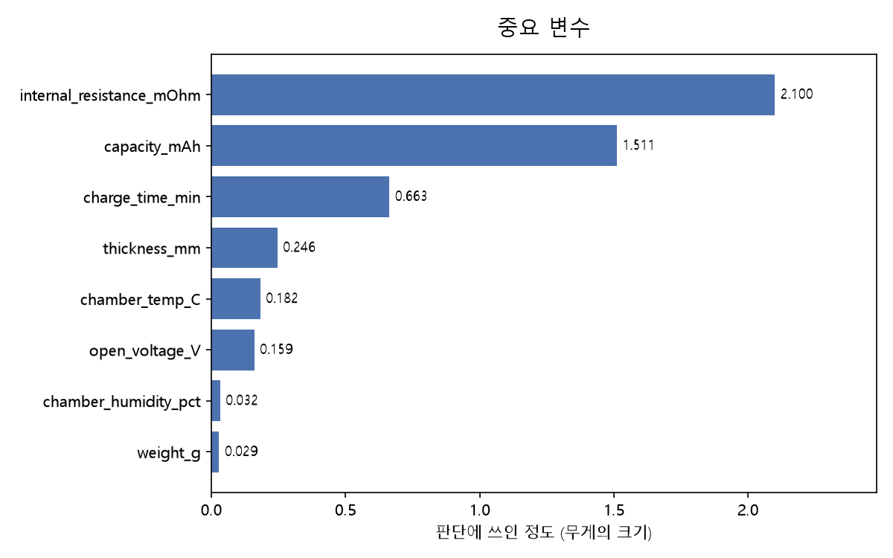
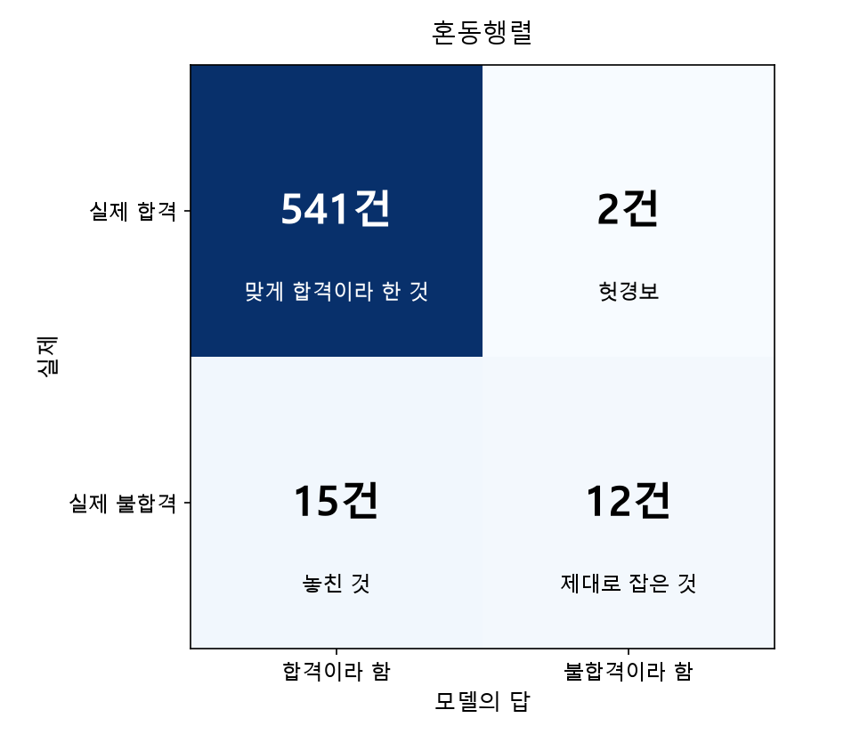
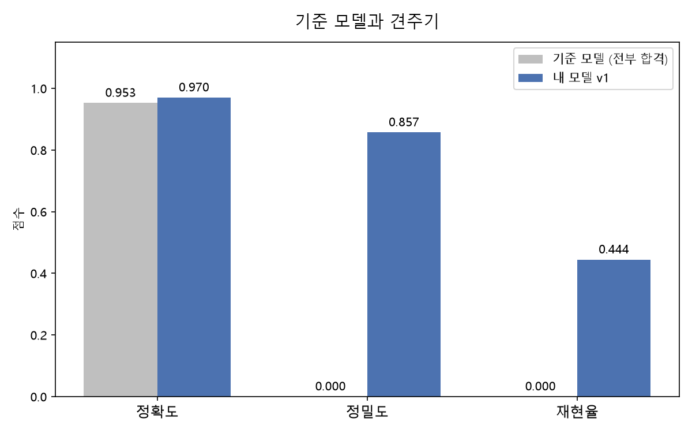

# 배터리 셀 검사 측정값으로 불합격 셀 미리 골라내기

측정 열 8개로 최종 검사 전에 정밀 재검사 대상을 추린다.

## 왜 이 문제인가

불합격 셀이 조립 공정까지 넘어가면, 완제품 단계에서 발견될 경우 묶음 전체를 다시 봐야 할 수 있다. 검사 단계에서 거르는 것과 조립 뒤에 아는 것은 비용이 다르다.

## 사용 데이터

| 항목 | 내용 |
|---|---|
| 규모 | 2,847행 × 14열 |
| 결과 열 | 합격 · 불합격 |
| 불합격 | 133건 (4.67%) |

> **데이터 출처** — 수업에서 받은 셀 검사 기록입니다.

## 무엇을 했나

- 숫자 측정 열 8개를 입력으로 씀
- 빈칸은 그 열의 중앙값으로 채움
- 8대 2로 비율을 맞춰 나눔
- 표준화 후 분류 모델을 학습시키고, 전부 합격이라 답하는 기준 모델과 견줌

## 결과 수치

| | 기준 모델 (전부 합격) | 내 모델 v1 |
|---|---|---|
| 정확도 | 95.26% | 97.02% |

- 지목한 14건 중 12건이 실제 불합격이었다 (정밀도 0.857)
- 실제 27건 중 15건은 놓쳤다 (재현율 0.444)
- 정확도 차이가 1.76%p뿐이라 정확도만으로는 판단할 수 없는 문제였다

## 결과 그림

### 중요 변수

### 혼동행렬

### 기준 모델과 견주기

## 의사결정 가치

측정값이 이 조건에 걸리는 셀을 최종 검사 전에 정밀 재검사 대상으로 빼두자는 것. 헛걸음 한 건보다 놓친 불합격 한 건이 비싼 공정이라면 문턱을 낮춰 지목을 늘리는 편이 낫다.

## 한계와 다음

- 라인과 근무조가 표에 있지만 첫 판에서는 숫자 열만 썼다
- 기록 기간이 짧아 원료 교체 같은 긴 흐름은 담기지 않았다
- 내부저항이 높은 구간에 불합격이 몰려 있었으나, 그것이 원인이라고 말할 수는 없다

다음에 고칠 것 두 가지

1. 빈칸을 나누기 전에 전체 중앙값으로 채웠으니 학습용 기준으로 바꿀 것
2. 드문 쪽을 무겁게 세었을 때 늘어나는 헛걸음(2건에서 76건)의 비용을 알아보고, 어느 쪽이 나은지 정할 것

## 아직 적지 않은 것

카드 여덟 칸에 없는 내용이라 비워두었다.

- 실행 방법 (필요한 라이브러리, 노트북 실행 순서)
- 데이터를 받은 정확한 경로나 링크
- 쓴 모델의 이름과 설정값
- 작성자 · 작성일
- 라이선스
